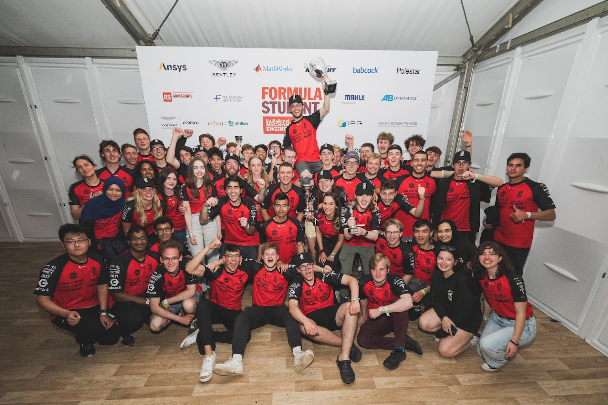

I'm a 3rd year [[💻 Computer Science|Computer Science]] student at the [[University of Edinburgh|University of Edinburgh]]. Welcome to my corner of the internet! 

### About Me:
- I ***co-founded*** my University's AI Society, [[EdinburghAI]], where I'm currently ***President***.
- I'm an active member of [[🏎️ EUFS|Edinburgh University Formula Student]], a society that builds self driving race cars from scratch. I'm currently trying to use [[AI|RL]] to optimise the global path around the race track. 
- This past summer, I interned at JPMorganChase as a [[💻 Computer Science|software engineer]]! 

> [!question] What is this website?
> It's a blend of my [[💻 Computer Science|University notes]], [[Personal Projects|personal projects]] and [[Essays|written essays]]! You can search for a given topic using the 🔍 icon at the top (eg. *"Memory Hierarchy"*). Alternatively, you can just click around (eg. [[(Computer) Memory Conceptually|Computer Memory]])!

  

    
    
<em>@ Winning Formula Student UK 2023, AI Division.</em>

  

  

    <h3>Where I've Worked:</h3>
    <ul>
      <li>In Summer 2023, I interned at <strong>JPMorganChase</strong> as a software engineer. I learned how to build at scale with AWS.</li>
      <li>I interned at <a href="https://itus-tech.com/" target="_blank">ITUS Secure Technologies</a>, a Cybersecurity startup that aided the recovery of cybercrime victims, as well as general security managed services.</li>
      <li>I spent a research internship at <a href="https://www.neuroconcise.co.uk/" target="_blank">NeuroConcise</a>. We developed a discreet EEG that allowed Locked-In patients to communicate with previously incommunicable patients.</li>
    </ul>
  

> [!example] The Target Audience? Me.
> These notes are primarily for myself while I [[Learning|learn]] something new. They're far from perfect and were never intended for an audience. But hey, that's how I learn. 
> 
> Also, some hyperlinks may not work - they're likely private notes (eg. [[Spirals|Spirals in Life]])

### Want to get in touch?
- Email Me: 
	- My email as hexadecimal: `6C656F63616D6163686F37303740676D61696C2E636F6D`
	- You can convert `hex -> ASCII` online with [CyberChef](https://gchq.github.io/CyberChef/#recipe=From_Hex('Auto')&input=NkM2NTZGNjM2MTZENjE2MzY4NkYzNzMwMzc0MDY3NkQ2MTY5NkMyRTYzNkY2RA).
	- *(If I pasted my email here, I'd get swarmed with bots.)*
- DM me on [Twitter](https://x.com/LeoCamacho43) *(still calling it that)*
- Message me on [LinkedIn](https://www.linkedin.com/in/leo-camacho)

